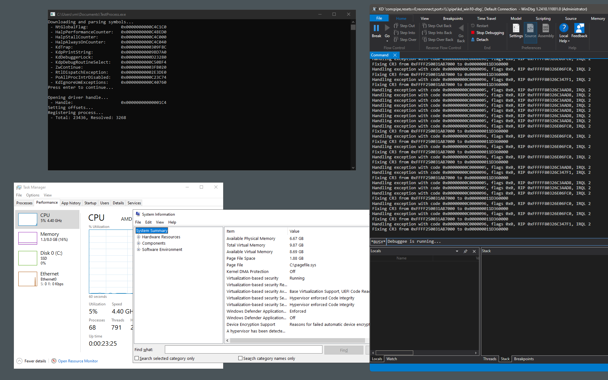
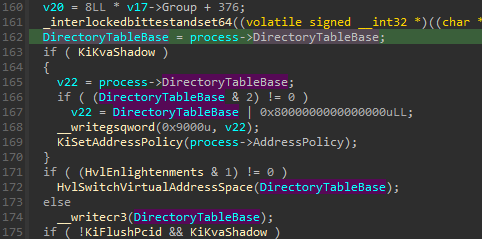
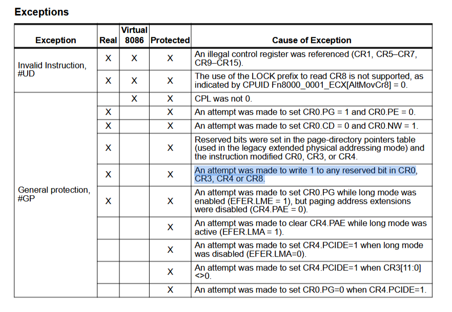
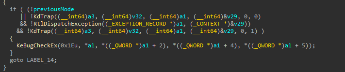
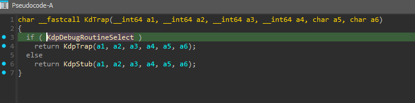
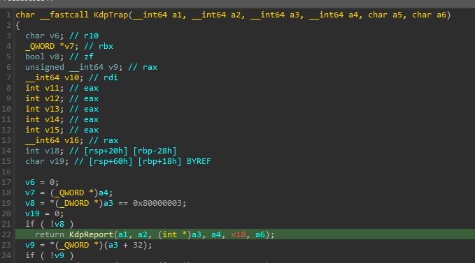
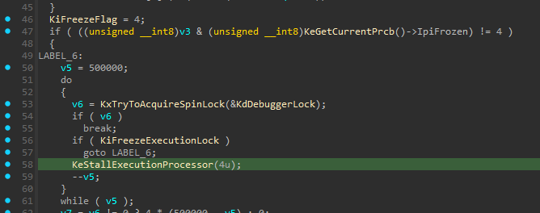
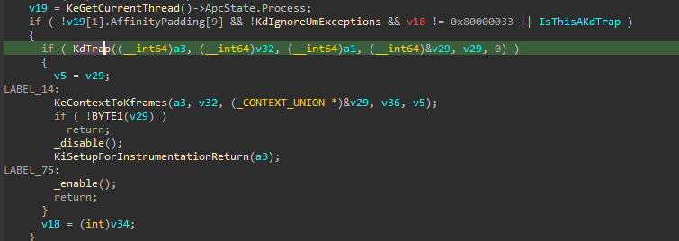
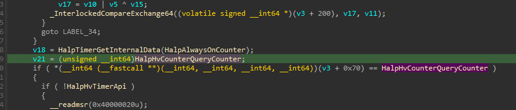

# HookGuard
Inspired by popular game anti-cheat solutions, this project utilizes a global kernel exception hook to obfuscate the target process's PML4 table address and log every attempted address space switch into the target process, while not triggering [PatchGuard](https://en.wikipedia.org/wiki/Kernel_Patch_Protection) and remaining [HVCI compatible](https://learn.microsoft.com/en-us/windows-hardware/drivers/bringup/device-guard-and-credential-guard).



## How does this work?
> [!WARNING]
> To have at least some chance of understanding what is going on, make sure you are aware of [the basics of memory paging](https://connormcgarr.github.io/paging/).

The value that is loaded into the `CR3` register on a [context switch](https://www.techtarget.com/whatis/definition/context-switch) or when [attaching to a process](https://learn.microsoft.com/en-us/windows-hardware/drivers/debuggercmds/-attach--attach-to-process-) (`KiAttachProcess`) is stored in `KPROCESS->DirectoryTableBase`.



If the value being written to `CR3` has any reserved bits (48:63) set to `1`, a general protection (`#GP`) exception will be triggered.



Under normal circumstances, this would result in an immediate system crash, but with a clever hook chain, it can be used to log and control any attempted writes of such a value.

Exceptions are handled in the `KiDispatchException` function. For kernel-mode exceptions, the debugger routine `KdTrap` is called first, and only if it returns `0`, indicating that the exception was not handled by the debugger, `RtlDispatchException` will be used, which will attempt to execute the appropriate exception handler.



`KdTrap` checks whether `KdpDebugRoutineSelect` is not null, and if so, it executes `KdpTrap`.



Unless the exception code is `0x80000003` (`STATUS_BREAKPOINT`), `KdpReport` will be executed, and the function will return.



`KdpReport` normally returns `0` and exits immediately (apart from debugger-specific exceptions) unless `NtGlobalFlag` has `FLG_STOP_ON_EXCEPTION`. This is not enabled by default, so we have to overwrite it. This will cause every exception to go to `KdEnterDebugger`, which then executes `KeFreezeExecution`.


Inside `KeFreezeExecution`, `KeStallExecutionProcessor` will be called if `KdDebuggerLock` is locked (has a non-zero value). We will overwrite it to always be `1`.



Finally, `KeStallExecutionProcessor` will end up calling `HalpStallCounter+0x70`, which we can overwrite to hook.


In our hook, we will perform a stack walk to locate `KeFreezeExecution` to get the original IRQL (changed in this function) and `KdTrap` to get the exception record and context.

```c
CONTEXT frames[10] = { 0 };
for (ULONG frame = 0; frame < 10; frame++)
{
    ULONG64 imageBase;
    const PRUNTIME_FUNCTION runtimeFunction = RtlLookupFunctionEntry(current.Rip, &imageBase, NULL);
    if (!runtimeFunction)
        break;

    PVOID handlerData;
    ULONG64 establisherFrame;
    KNONVOLATILE_CONTEXT_POINTERS nvContext = { 0 };
    RtlVirtualUnwind(
        UNW_FLAG_NHANDLER,
        imageBase,
        current.Rip,
        runtimeFunction,
        &current,
        &handlerData,
        &establisherFrame,
        &nvContext);

    if (!current.Rip)
        break;

    frames[frame] = current;

    if (!(current.Rip >= g_KdTrap && current.Rip < g_KdTrap + 0x50))
        continue;

    /*
     * 0: HookGuard!HookEntry+0x2d
     * 1: nt!KeStallExecutionProcessor+0x9b
     * 2: nt!KeFreezeExecution+0x110
     * 3: nt!KdEnterDebugger+0x6d
     * 4: nt!KdpReport+0x74
     * 5: nt!KdpTrap+0x160
     * 6: nt!KdTrap+0x2d
     */
    const ULONG64 originalIrql = *(ULONG64*)(frames[2].Rsp + sizeof(ULONG64) * 1);

    _enable();
    __writecr8(originalIrql);

    const PEXCEPTION_RECORD exceptionRecord = *(PEXCEPTION_RECORD*)current.Rsp;
    const PCONTEXT exceptionContext = *(PCONTEXT*)(current.Rsp + sizeof(ULONG64) * 10);
    /* ... */
}
```

Then, we can implement custom exception handling when an invalid `CR3` is written to for example use a custom hash function on it.

```c
VOID HookHandlePrivilegedInstruction(PEXCEPTION_RECORD exceptionRecord, PCONTEXT context)
{
    if (exceptionRecord->ExceptionCode != STATUS_PRIVILEGED_INSTRUCTION)
        return;

    // mov cr3, xxx
    if (*(PWORD)context->Rip != 0x220F)
        return;

    BYTE operand = *(PBYTE)(context->Rip + 2);
    operand &= 7;

    const UINT64* registers = &context->Rax;
    const UINT64 invalidCr3 = registers[operand];

    CR3 cr3;
    cr3.AsUInt = invalidCr3;
    cr3.Reserved3 = 0x0;
    cr3.AddressOfPageDirectory = GuardCrypt(cr3.AddressOfPageDirectory);

    KdpPrint("Fixing CR3 from 0x%p to 0x%p\n", invalidCr3, cr3.AsUInt);
    InterlockedIncrement64(&g_TotalResolved);
    __writecr3(cr3.AsUInt);

    context->Rip += 3;

    g_ZwContinue(context, FALSE);

    HookBreakpoint();
}
```

Remember that under normal circumstances, `KdTrap` would return `0`, and `RtlDispatchException` would be called. This is not the case here due to our modifications. We can either try to restore the context and return from `KdTrap`, or, if we want to make our life easier, we can just directly call `RtlDispatchException`.

```c
if (exceptionRecord->ExceptionCode == STATUS_PRIVILEGED_INSTRUCTION)
    HookHandlePrivilegedInstruction(exceptionRecord, exceptionContext);

g_RtlDispatchException(exceptionRecord, exceptionContext);
```

We also need to make two more overwrites. One is `KdIgnoreUmExceptions`, so that `KdTrap` won't get called when handling user-mode exceptions, and the other is `PoAllProcIntrDisabled` to speed up execution.



## Compiling and testing
To compile the project, you will need [Visual Studio 2022](https://visualstudio.microsoft.com/) with the [Windows Driver Kit (WDK)](https://learn.microsoft.com/en-us/windows-hardware/drivers/download-the-wdk) and the associated Windows SDK installed.

Compile the driver with a test signing certificate, and enable [test signing mode](https://learn.microsoft.com/en-us/windows-hardware/drivers/install/the-testsigning-boot-configuration-option) if you haven't already:
```
bcdedit /set TESTSIGNING ON
```

Register and start the driver:
```
sc create HookGuard binPath="C:\HookGuard.sys" type=kernel
sc start HookGuard
```

Launch the test process `TestProcess.exe`. An internet connection is required so that [debug symbols](https://en.wikipedia.org/wiki/Debug_symbol) can be downloaded and parsed.

> [!TIP]
> If you are going to use a kernel-mode debugger, keep in mind that breakpoints also trigger exceptions and subsequent calls to the hooked routine. Placing breakpoints in certain places (like the start of `KdTrap`) will cause the debugger and system to hang.

## Compatibility
This project was tested on Windows 10 22H2 19045.5011. **Windows 11 is not supported**, as it does not use `HalpStallCounter` in `KeStallExecutionProcessor`. 

However, it is possible to use `HalpPerformanceCounter` instead. I have already spent a few dozen hours jumping between IDA and WinDbg, so I am just going to leave it as is. If I ever revisit this project, reworking it to function on Windows 11 would be the priority.



## Credits
- [EasyPdb](https://github.com/Kwansy98/EasyPdb) - used by `TestProcess.exe` to send offsets into the driver
- [ia32-doc](https://github.com/ia32-doc/ia32-doc) - platform definitions
- [EAC CR3 protection article](https://0avx.github.io/posts/easyanticheat-cr3-protection/) by [@0avx](https://github.com/0avx) - at least to my knowledge, this is one of the first more in-depth articles about the subject, inspiration
